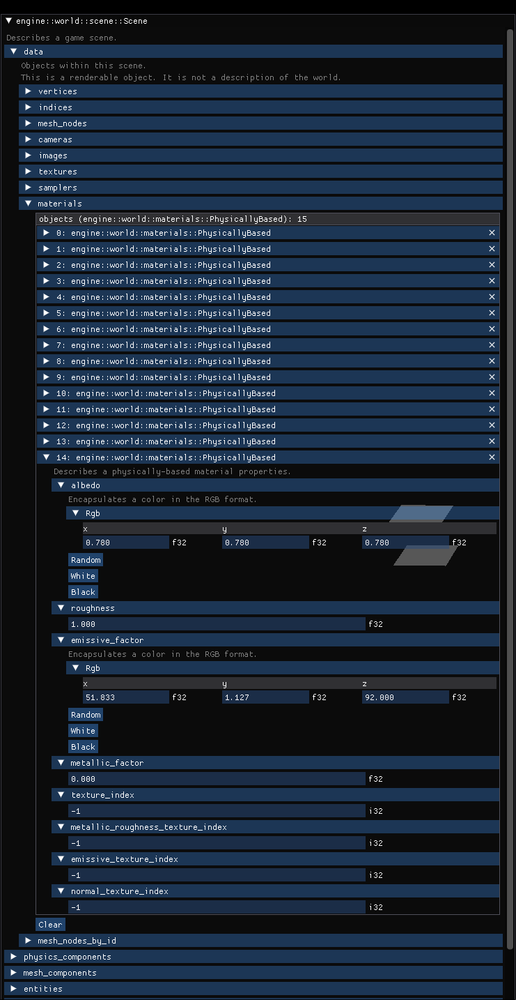

# ImGui Presentable

A derive-macro for easily showing your structs as an ImGui component.

## Example

```rust
/// Describes a game scene.
#[derive(Builder, Debug, Clone, serde::Serialize, serde::Deserialize, ImguiPresentation)]
#[imgui_presentation(button("Reload from file": "reload"))]
#[imgui_presentation(button("Render": "reload_imgui"))]
pub struct Scene {
    #[builder(default)]
    #[imgui_presentation(skip)]
    magic_header: MagicHeader,
    #[imgui_presentation(skip)]
    id: uuid::Uuid,
    // /// All actors of this scene.
    // pub actors: Vec<Box<dyn Actor>>,
    // /// All the meshes within this scene.
    // pub meshes: BTreeMap<MeshId, Mesh>
    /// Scene path.
    #[imgui_presentation(skip)]
    path: std::path::PathBuf,
    /// Objects within this scene.
    data: Data,
    #[builder(default)]
    physics_components: IndexedComponentsStorage<PhysicsComponent>,
    #[builder(default)]
    mesh_components: IndexedComponentsStorage<MeshComponent>,
    #[builder(default)]
    entities: HashSet<Entity>,
    #[serde(skip)]
    #[builder(default)]
    entity_change_set: EntityChangeSet,
    #[builder(default)]
    farthest_object_distance: f32,
}
```
Deriving the `ImguiPresentation` implements the following trait, namely overrides the `render_component` and `render_component_mut` where possible:

```rust
/// Allows the implementing object to be rendered as an ImGUI component.
pub trait ImguiPresentable {
    /// Renders the implementor as a stand-alone window not allowing to
    /// change the values.
    fn render_window(&self, ui: &imgui::Ui, extent: Extent) {
        ui.window(std::any::type_name::<Self>())
            .resizable(true)
            .collapsible(true)
            .position([0.0, 0.0], imgui::Condition::FirstUseEver)
            .build(|| self.render_component(ui, extent));
    }

    /// Renders the implementor as a sub-component not allowing to
    /// change the values.
    fn render_component(&self, ui: &imgui::Ui, extent: Extent);

    /// Renders the implementor as a stand-alone window allowing to
    /// change the values.
    fn render_window_mut(&mut self, ui: &imgui::Ui, extent: Extent) {
        ui.window(std::any::type_name::<Self>())
            .resizable(true)
            .collapsible(true)
            .position([0.0, 0.0], imgui::Condition::FirstUseEver)
            .build(|| self.render_component_mut(ui, extent));
    }

    /// Renders the implementor as a sub-component allowing to change
    /// the values.
    ///
    /// # Note
    ///
    /// If not re-implemented, the default implementation shows the
    /// immutable UI.
    fn render_component_mut(&mut self, ui: &imgui::Ui, extent: Extent) {
        // ui.text("This struct doesn't provide a mutable ui.");
        self.render_component(ui, extent);
    }
}
```

This leads to this:


